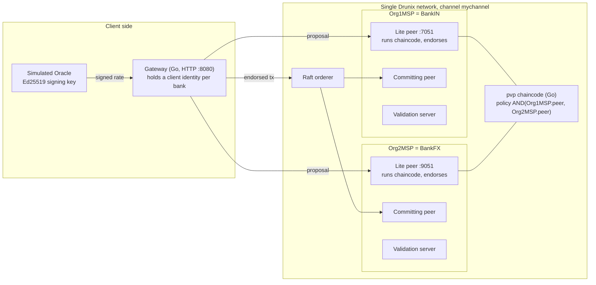

<div align="center">

<h1>Advaita</h1>

Both-or-neither settlement for USD/INR trades between two banks, on NPCI's Drunix ledger.

</div>

---

## 1. What this solves

When an Indian bank and a foreign bank settle an FX trade, each pays its own leg separately. If one bank pays and the other does not, the first bank loses the full amount. This is called principal or Herstatt risk. The usual fix is payment-versus-payment (PvP), where neither leg settles unless both do. CLS, the main PvP system, covers 18 currencies, and INR is not one of them.

## 2. What we built

Advaita is a working prototype of a PvP settlement layer for USD/INR on a single Drunix network (Drunix is NPCI's fork of Hyperledger Fabric). Two banks, BankIN and BankFX, each instruct the same trade terms. A single chaincode transaction then moves the INR leg and the USD leg together. Fabric either commits that whole transaction or none of it, so a trade either fully settles or nothing moves. On top of that we built a defined set of defences: the chaincode refuses double-settlement, replay, underfunded trades, forged or mismatched instructions, unsigned or tampered FX rates, and bad amounts. It also checks a value-conservation invariant on every settlement. The network rejects any settlement that only one bank's peer endorsed. All cash on the ledger is simulated. Every behaviour described below is covered by unit tests, and most of it also by integration tests against a live Drunix network.

## 3. Architecture



**Why each piece exists**

| Piece | What it is here | Why |
|---|---|---|
| Single Drunix network | NPCI's Drunix test network (commit `ddc0eae`), one channel `mychannel`, one Raft orderer, YugabyteDB state database | Both banks share one ledger, so one transaction can touch both banks' balances. We make no claim about atomicity across two separate networks. |
| Org1MSP (BankIN) | Holds tokenized INR at the start | The Indian bank. |
| Org2MSP (BankFX) | Holds tokenized USD at the start | The foreign bank. |
| Lite peers (`:7051`, `:9051`) | Drunix splits a peer's roles. The lite peer runs chaincode and endorses. The committing peer and validation server handle commit. | Each bank runs its own copy of the chaincode, so no single bank decides the result. |
| Endorsement policy `AND('Org1MSP.peer','Org2MSP.peer')` | Set when the chaincode was deployed | A transaction is valid only if a peer from each bank executed it and signed the same result. |
| `pvp` chaincode (Go) | All settlement rules: instructions, rate checks, settlement, the invariant, queries | The rules run inside the ledger, not in an app that one party controls. |
| Oracle | An Ed25519 key. Its public half is pinned in the ledger config at initialisation. | The chaincode accepts an FX rate only if this key signed it. The oracle is simulated. There is no live market feed. |
| Gateway | Go HTTP service using the Fabric Gateway SDK | Submits transactions and queries. It returns real before and after balance reads with every write, and it runs the attack scenarios. |

**Not built yet:** the Oracle and the Auditor are not separate orgs (MSPs) on the channel. The stock Drunix test network has two peer orgs, and we have not yet added more. The Oracle is a pinned key, and the audit endpoint reads the ledger with BankIN's identity.

## 4. How it works, step by step

**A trade that settles**

1. **Oracle publishes a rate.** The oracle signs a USD/INR rate with a sequence number, for example seq 1 = 83.250000. Any bank can relay it with `PublishRate`. The chaincode checks the signature against the pinned key and requires the sequence number to be higher than any rate already published. It then stores the rate.
2. **The INR amount is quoted by the chaincode.** `QuoteINR` returns the INR leg for a USD amount at a published rate. It uses integer math (paise = cents x rate, rounded half-up), so no client computes the price itself.
3. **BankIN instructs.** It calls `SubmitInstruction` with the trade ID, which bank pays USD, both amounts and the rate sequence number. The chaincode reads the submitter's MSP from the signed proposal. The instruction must say it comes from that same bank. The trade is now `PENDING_MATCH`.
4. **BankFX instructs the same terms.** If every term matches, the trade becomes `MATCHED`. If any term differs, the instruction is rejected.
5. **Either bank calls `SettleTrade`.** In one transaction the chaincode:
   - checks that the trade is `MATCHED` and not already settled,
   - rechecks that the rate is still fresh and that the amounts match it,
   - reads every balance and checks both payers can cover their legs,
   - computes both legs in memory (USD from one bank to the other, INR back the other way),
   - checks the value-conservation invariant on the result,
   - and only then writes all four balances, marks the trade `SETTLED`, and appends to the audit log.
6. **Both banks' peers endorse, the orderer orders it, and it commits.** Fabric commits every write in the transaction, or none of them.
7. **Audit.** `GetAuditLog` returns an append-only log (`INIT`, `RATE_PUBLISHED`, `INSTRUCTED`, `SETTLED`) with transaction IDs. `GetTrade` shows the trade's balances just before and just after settlement.

**A trade that fails**

Suppose BankFX must deliver more USD than it holds. The INR leg is fundable. `SettleTrade` finds the shortfall before writing anything and returns `ERR_INSUFFICIENT_FUNDS: ... Neither leg was paid`. Because the chaincode returned an error, no endorsement is produced and nothing is written. The trade stays `MATCHED` and every balance is unchanged. The unit tests check that the rejected call attempted no writes at all. The integration tests read the balances from both banks' peers and check they are identical before and after.

Rejected transactions never reach the ledger, by design. The gateway keeps an in-memory log of refused attempts (`GET /api/rejections`) so they can be shown. That log is not ledger data.

## 5. Security

We treat security as the main feature, not an add-on. Each check below runs in the chaincode or in the network's validation. Each one has its own error code, returned verbatim to the client.

### Threat matrix

"Unit" means covered by the Go unit tests. "Live" means also exercised against the running Drunix network through the gateway.

| Attack | What stops it | Code returned | Tested |
|---|---|---|---|
| Settle the same trade twice | Trade status is `SETTLED`; settlement refuses it | `ERR_ALREADY_SETTLED` | Unit, Live |
| Replay an old instruction to reopen a settled trade | Instruction refused for a settled trade | `ERR_REPLAY` | Unit, Live |
| Two conflicting settlements endorsed against the same state | Fabric's version check at commit invalidates the second | `MVCC_READ_CONFLICT` | Live |
| Settle while underfunded | Funds checked for every payer before any write | `ERR_INSUFFICIENT_FUNDS` | Unit, Live |
| Settlement endorsed by one bank's peer only | Network validation of `AND(Org1MSP.peer, Org2MSP.peer)` | `ENDORSEMENT_POLICY_FAILURE` | Live |
| Settle a trade the other bank never agreed to | Settlement needs matching instructions from both banks | `ERR_UNILATERAL` | Unit, Live |
| Bank A instructs on behalf of bank B | Submitter's MSP must match the bank named in the instruction | `ERR_FORGED_INSTRUCTION` | Unit, Live |
| Counterparty "matches" with different terms | Every term compared; any difference refused | `ERR_INSTRUCTION_MISMATCH` | Unit, Live |
| A bank instructs twice to match itself | Second instruction from the same bank refused | `ERR_DUPLICATE_INSTRUCTION` | Unit |
| A non-bank identity tries to move value | Only the two bank MSPs may instruct or settle | `ERR_UNAUTHORIZED` | Unit |
| Unsigned FX rate | Signature required | `ERR_ATTESTATION_UNSIGNED` | Unit, Live |
| Genuine signed rate with the number edited | Signature no longer verifies | `ERR_ATTESTATION_BAD_SIGNATURE` | Unit, Live |
| Rate signed by a colluding oracle key | Only the key pinned at init is accepted | `ERR_ATTESTATION_BAD_SIGNATURE` | Unit, Live |
| Re-publish an old genuine rate | Sequence number must exceed the latest | `ERR_ATTESTATION_STALE` | Unit, Live |
| Use a rate that has gone stale (at instruction or at settlement) | Only the latest 3 published rates are accepted | `ERR_ATTESTATION_STALE` | Unit |
| Reference a rate that was never published | Rate must exist on the ledger | `ERR_ATTESTATION_UNKNOWN` | Unit |
| Price the INR leg off the attested rate, even by 1 paisa | INR leg must equal USD leg x attested rate exactly | `ERR_RATE_MISMATCH` | Unit, Live |
| Smuggle a field separator into the rate's source name | Field validation | `ERR_INVALID_INPUT` | Unit |
| Negative, zero, decimal, `1e5`, `+100`, leading zeros | Strict integer parsing in minor units | `ERR_INVALID_AMOUNT` | Unit, Live |
| Amount above int64, or above the 10^15 cap | Range checks, and checked arithmetic with big integers | `ERR_AMOUNT_OVERFLOW` | Unit, Live |
| Extra JSON fields (e.g. trying to override the rate) | Unknown fields and trailing data refused | `ERR_INVALID_INPUT` | Unit |
| Re-run InitLedger to pin a new oracle key and mint balances | Initialisation runs once | `ERR_ALREADY_INITIALIZED` | Unit, Live |
| Value created or destroyed outside the rules | Value-conservation invariant (below) | `ERR_INVARIANT_VIOLATION` | Unit |
| One bank's peer is offline | Endorsement cannot be collected; nothing is submitted | `ENDORSE_FAILED` or `ENDORSER_UNAVAILABLE` | Live (opt-in test) |

For every rejection above, the unit tests also check three things: the call attempted no writes, committed state is unchanged byte for byte, and the invariant still holds afterwards.

### Value-conservation invariant

This is enforced in chaincode, not formally proven. At `InitLedger`, the total of the opening balances in each currency becomes that currency's fixed supply. In every settlement, before anything is written, the chaincode:

1. scans every balance key on the ledger (not a fixed list, so an unexpected extra account is still counted),
2. overlays the new balances the transaction is about to write (Fabric does not let a transaction read its own writes, so this has to happen in memory),
3. sums each currency and compares the total with the fixed supply,
4. and checks that no balance is negative.

If any check fails, the transaction is refused with `ERR_INVARIANT_VIOLATION`. `CheckInvariant` and `GetBalances` recompute the same sums from live state on demand.

Tests for this:
- A seeded sequence of 300 random operations (rates, forged-rate attacks, trades in both directions, some underfunded). The invariant is recomputed after every step. In the current run, 62 settlements committed, 179 attempts were rejected, and the invariant held throughout.
- Tests that corrupt the ledger state directly: one balance inflated by a single cent, a stray account added, an unissued currency added. In each case the invariant reports the breach, and the next settlement is refused.
- A post-state where the total is right but one balance is negative is also refused.

### A malicious participant, not just bad input

We model BankFX as hostile. It has valid network credentials and controls its own peer. Two separate controls matter here.

- **Consent comes from instructions, not endorsement.** A peer endorses whatever the chaincode accepts, so endorsement alone does not mean a bank agreed to a trade. Agreement comes from each bank's own instruction, bound to its authenticated MSP identity. BankFX cannot write BankIN's instruction (`ERR_FORGED_INSTRUCTION`), cannot settle without it (`ERR_UNILATERAL`), and cannot slip in different terms (`ERR_INSTRUCTION_MISMATCH`).
- **The AND policy stops a peer from making up results.** Even if BankFX ran modified chaincode on its own peer, a transaction endorsed only by BankFX is invalid. On the live network, such a transaction was ordered into a block and then invalidated with `ENDORSEMENT_POLICY_FAILURE`. The same trade then settled normally once both banks endorsed it.

`TestThreat_MaliciousOrg_FullScenario` runs nine attacks from BankFX in a row. Every one is refused with its expected code, BankIN's balances are unchanged, and the invariant holds after each step.

### How we checked that the tests catch real bugs

`scripts/mutation-check.sh` copies the chaincode, injects one realistic bug at a time, and reruns the unit tests. Examples of injected bugs: the receiver is never credited, the funds check is removed, signature verification is bypassed, the stale-rate window is off by one, rounding is changed to truncation. All 21 injected bugs are caught.

## 6. Impact

**Who it is for.** Banks settling USD/INR trades, NPCI as a neutral operator of shared infrastructure, and regulators who want to see what settled and at what rate.

**What this prototype shows**
- Two banks can settle both legs of a trade in one ledger transaction, on NPCI's own platform.
- A defined set of attacks, including from a hostile bank with valid credentials, is refused with a specific reason and moves no value.
- A regulator-style reader can see an ordered audit log, the signed rate each trade used, and live conservation totals.

**What full deployment would need, and this prototype does not have**
- A real settlement asset, such as central bank money or a wholesale CBDC. Here the balances are simulated.
- Legal settlement finality, rulebooks, and governance between participating banks and NPCI.
- Real key management (hardware security modules), with each bank running its own gateway and keys.
- A real rate source and its governance.
- More participants, liquidity arrangements, and operational resilience testing.
- Regulatory approval.

## 7. Feasibility

**Runs today (tested)**
- The Drunix test network (commit `ddc0eae`) running locally in Docker on Windows 11 with WSL2: 1 orderer, 2 orgs, each with a lite peer, committing peer and validation server, plus YugabyteDB and KeyDB.
- The `pvp` chaincode, deployed with policy `AND('Org1MSP.peer','Org2MSP.peer')`.
- The gateway HTTP API, including all attack scenarios.
- 38 chaincode unit tests (plus 9 subtests), the 21-bug mutation check, and 7 integration tests against the live network (the threat-matrix test has 13 subtests). The peer-down test stops and restarts a real peer container.

**Simulated**
- All balances. The opening balances are 500,000,000.00 INR for BankIN and 5,000,000.00 USD for BankFX. No real money or liquidity is involved.
- The oracle. It uses a real Ed25519 key, but the rate is whatever the operator publishes.
- One gateway process holds a client identity for both banks, so a single machine can drive the demo. In practice each bank would sign with its own keys in its own systems.

**Not done**
- Bilateral netting (`netSettle`). The roadmap gates this, and it is not built.
- The compliance record (purpose code, simulated AML result) and the private data collection. Not built.
- The Auditor and the Oracle as their own MSPs on the channel. Not built.
- The frontend (bank dashboards, settlement screen, auditor view). Not built. Today the system is driven through the HTTP API, the `pvpctl` CLI and the tests.

## 8. USPs and novelty

- **INR PvP on a neutral, shared utility.** The ledger runs on NPCI's Drunix. That makes it shared infrastructure that no single bank owns, rather than one bank's platform.
- **Interbank and atomic.** The two legs belong to two different banks, and they move in one ledger transaction.
- **Security first.** Every defence has a stable error code, the rejections are tested individually on the live network, and the tests are checked with mutation testing.
- **Hostile-participant model.** We test against a bank with valid credentials that attacks, not only against malformed input.
- **Why a ledger and not a shared database:** two banks that don't trust each other need all-or-nothing settlement of two currency legs. A shared database or registry can record it but cannot atomically enforce it. Only a ledger with atomic commit and endorsement by both organisations can.

**Compared with Citi Token Services (CTS).** From public information, CTS runs on Citi's own network for Citi's clients and is focused on USD and a small set of major currencies. We have not seen INR PvP in it. We do not claim CTS cannot do PvP. The difference we are pointing at is this: Advaita is INR-focused, runs on NPCI's neutral shared infrastructure rather than inside one bank, and puts deterministic attack rejection and regulator visibility at the centre.

## 9. Tech stack

| Layer | Choice | Why |
|---|---|---|
| Ledger | Drunix 1.0.0 (Hyperledger Fabric v2.5-compatible fork), Raft ordering, YugabyteDB state DB | NPCI's platform, and the hackathon target. |
| Chaincode | Go 1.23 module, `fabric-contract-api-go/v2` v2.2.0, `fabric-chaincode-go/v2` v2.0.0 | Go is what the Drunix samples use and what we verified on this network. |
| Rate signatures | Ed25519 (Go standard library) | Deterministic verification. The chaincode and the signer share one payload definition (`chaincode/pvp/attest`). |
| Gateway | Go, `fabric-gateway` v1.10.0, `net/http` | Same version as the Drunix Go gateway sample, which we ran successfully against this network. |
| Runtime | Docker Desktop with WSL2 (Ubuntu), Go 1.26.1 inside WSL | Drunix's scripts need Linux. |
| Money | Integer minor units (paise, cents), with big-integer math for FX conversion | No floats. Overflow cannot silently wrap. |

## 10. How to run

These are the commands we ran. Run them inside WSL (Ubuntu) as root, with the repo at `/mnt/c/Advait`. `scripts/mutation-check.sh` assumes that path.

**Prerequisites (Windows)**
- Docker Desktop with WSL2 integration enabled for the Ubuntu distro.
- About 10 GB of RAM for WSL. We set `memory=10GB` in `%USERPROFILE%\.wslconfig`. The network runs 11 containers.

**1. Tools inside WSL**
```bash
apt-get update && apt-get install -y golang-go jq make build-essential
```

**2. Build Drunix binaries that match the Docker images**

Do not use `./network.sh prereq`. It downloads stock Fabric binaries, not Drunix ones (see `NOTES.md` D1).
```bash
git clone --depth 1 https://github.com/npci/drunix.git /root/drunix
cd /root/drunix && make tools orderer
mkdir -p drunix-network/bin && cp build/bin/* drunix-network/bin/
docker pull npcioss/drunix-ccenv:1.0      # not pulled automatically (NOTES.md D5)
docker pull npcioss/drunix-baseos:1.0
```

**3. Bring up the network and channel**
```bash
export PATH=$PATH:/root/drunix/drunix-network/bin
export FABRIC_CFG_PATH=/root/drunix/drunix-network/config
cd /root/drunix/drunix-network/test-network
./network.sh up
./network.sh createChannel
```

**4. Build the gateway tools and create the oracle key**
```bash
cd /mnt/c/Advait/gateway && go build -o /root/bin/ ./cmd/...
cd /mnt/c/Advait && [ -f network/oracle/oracle.key ] || /root/bin/oracle keygen network/oracle
```
`oracle.key` is git-ignored. Only `oracle.pub` is committed.

**5. Deploy the chaincode, initialise the ledger, publish a rate**
```bash
cd /mnt/c/Advait
bash network/deploy-cc.sh 1.0                                # policy AND('Org1MSP.peer','Org2MSP.peer')
/root/bin/pvpctl init network/oracle/oracle.pub              # once only; a second run returns ERR_ALREADY_INITIALIZED
/root/bin/pvpctl publish network/oracle/oracle.key 83250000  # USD/INR = 83.250000
/root/bin/pvpctl query GetBalances
```

**6. Start the gateway**
```bash
cd /mnt/c/Advait/gateway && /root/bin/gateway      # listens on :8080
```
From Windows or WSL:
```bash
curl http://localhost:8080/api/state
curl -X POST http://localhost:8080/api/attacks/forged-instruction
```
Other endpoints: `GET /api/health`, `/api/audit`, `/api/quote?usd=&seq=`, `/api/attacks`, `/api/rejections`, and `POST /api/oracle/rates`, `/api/instructions`, `/api/trades/{id}/settle`, `/api/attacks/{name}`.

**7. Run the tests**
```bash
# Chaincode unit tests
cd /mnt/c/Advait/chaincode/pvp && go vet ./... && go test ./... -count=1 -v

# Mutation check (works on a temporary copy; the repo is not modified)
bash /mnt/c/Advait/scripts/mutation-check.sh

# Integration tests (network and gateway must be running)
cd /mnt/c/Advait/gateway && go test -tags integration ./integration/ -count=1 -v

# Also run the peer-down test, which stops and restarts BankFX's peer container
RUN_DISRUPTIVE=1 go test -tags integration ./integration/ -count=1 -v
```

To start over from an empty ledger, run `./network.sh down` and repeat steps 3 and 5. We have not scripted this reset yet.

## 11. Limitations and future work

**Limitations**
- **Single network only.** Both banks are orgs on one Drunix network. There is no atomicity across two separate networks.
- **Netting is not built.** `netSettle` does not exist yet. Every trade settles gross.
- **Simulated cash and a simulated oracle.** No real INR or USD moves, and no liquidity is created. The rate is typed in by the operator.
- **No real CBDC or central bank money.** At most the design could be called CBDC-ready. Nothing is integrated.
- **Only two MSPs.** The Oracle and the Auditor are not their own MSPs on the channel. The Oracle is a pinned key, and the audit endpoint reads the ledger with BankIN's identity.
- **Compliance records and private data are not built.**
- **Peer-down error label.** When BankFX's peer is stopped, the refusal sometimes comes back as `ENDORSE_FAILED` and sometimes as `ENDORSER_UNAVAILABLE`. The attack catalogue expects `ENDORSER_UNAVAILABLE`, so its `expectedCode` flag can read `false` on a correct refusal. The integration test accepts any endorsement-stage refusal. This is a labelling issue in the gateway, not a security gap.
- **Trusted bootstrap.** `InitLedger` configuration (bank MSPs, oracle key, opening balances) is trusted once at deployment. It cannot be changed afterwards.
- **Griefing.** A hostile bank that instructs a trade ID first with bad terms can block the honest bank's instruction for that trade. The system stays safe (nothing moves), but there is no cancel function.
- **One gateway, both banks' keys.** This is a demo simplification.
- **Drunix-specific behaviour.** Several findings are logged in `NOTES.md`. For example, block validation flags read VALID even for a transaction that was invalidated (D8), so we check rejections through state and commit status instead.

**Future work**
- Bilateral netting of a batch of matched trades, settled as one atomic net movement.
- Oracle and Auditor as their own MSPs, and compliance records in a private data collection readable by the banks and the Auditor.
- The frontend: two bank dashboards, a settlement view, an auditor view.
- A settlement asset backed by real central bank money or a wholesale CBDC leg.
- Multilateral netting (three or more banks).
- Atomic settlement across separate networks.
- A live compliance engine.

---

**FACT.** INR is not among the currencies CLS settles (CLS covers 18). Extending PvP to more currencies is a stated priority in BIS, G20 cross-border payments and Basel Committee work. Sources: CLS Group; BIS Triennial Survey 2025 and BIS Quarterly Review.

**OUR IMPLEMENTATION.** Atomic two-leg USD/INR settlement on a single Drunix network. Endorsement by both banks is required. Consent is based on matching instructions. The chaincode refuses a defined threat set, including attacks from a hostile participant. A value-conservation invariant is checked on every settlement. FX rates are oracle-signed. There is an append-only audit log. All cash is simulated.

**LIMITATIONS.** Creates no liquidity. Single network. Two MSPs only. No netting, compliance records or frontend yet. Simulated oracle and cash. No real banks or governance.

**FUTURE WORK.** Bilateral then multilateral netting, separate Auditor and Oracle orgs with private compliance data, a real wholesale CBDC or central bank money leg, and settlement across separate networks.
