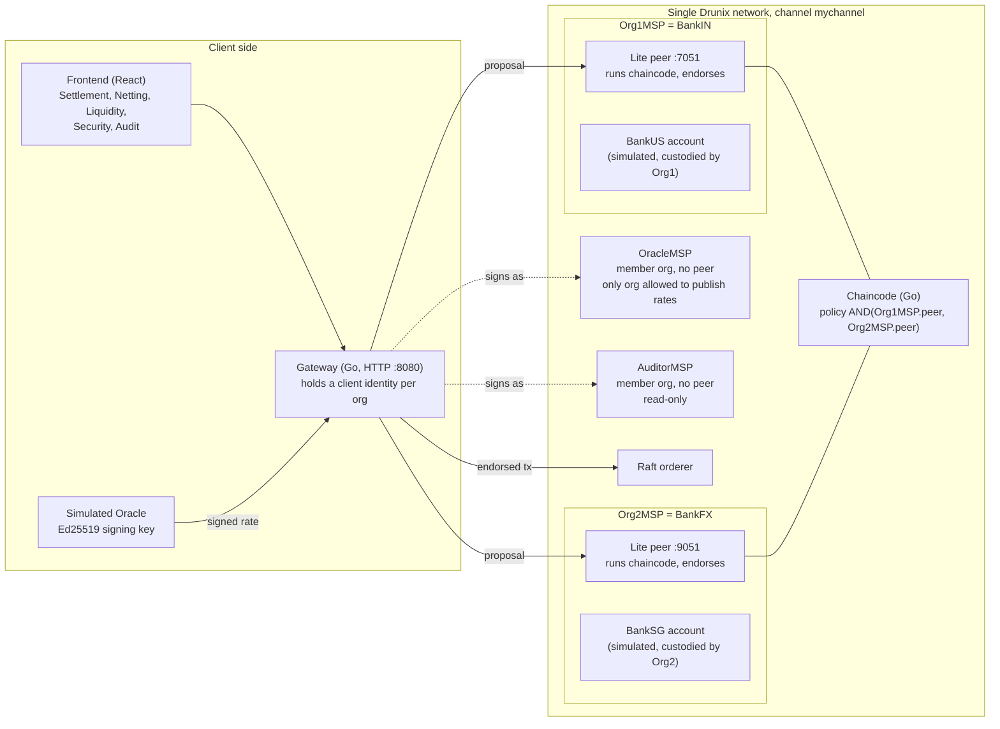

<div align="center">

<h1>Advait</h1>

Payment-versus-payment settlement for USD/INR trades on NPCI's Drunix ledger: neither currency leg moves unless both do.

</div>

---

## 1. The problem

When an Indian bank and a foreign bank settle an FX trade today, each pays its own leg separately. If one bank pays and the other does not, the first bank loses the full principal. This is principal risk, often called Herstatt risk. The established remedy is payment-versus-payment (PvP), where neither leg settles unless both do.

CLS, the main PvP system, settles 18 currencies. INR is not one of them. Extending PvP to more currencies is a stated priority in BIS, G20 cross-border payments and Basel Committee work (sources: CLS Group; BIS Triennial Survey 2025; BIS Quarterly Review).

## 2. What Advait does

Advait is a working prototype of a PvP settlement layer for USD/INR on a single Drunix network. Drunix is NPCI's fork of Hyperledger Fabric.

- **Atomic two-leg settlement.** Two banks each instruct the same trade terms. One chaincode transaction then moves the INR leg and the USD leg together. Fabric commits the whole transaction or none of it, so a trade either fully settles or nothing moves.
- **Consent from both banks.** A trade settles only after both banks have instructed identical terms from their own authenticated identities, and the network accepts a settlement only if both banks' peers endorsed it.
- **Deterministic attack rejection.** The chaincode refuses a defined set of attacks, including attacks from a bank with valid credentials, each with its own error code. A value-conservation invariant is checked on every settlement.
- **Netting.** Bilateral netting settles a batch of trades between the two banks as one net payment per currency. The liquidity engine nets across four ledger accounts and, when a bank cannot fund its net position, drops trades by a fixed, deterministic rule and settles the rest in one transaction, or nothing.
- **Regulator visibility.** An Auditor identity reads an append-only audit log, the signed FX rate each trade used, and live conservation totals.

All cash on the ledger is simulated tokenized balance. No real money moves and no liquidity is created.

## 3. Architecture



| Piece | What it is | Why it is there |
|---|---|---|
| Single Drunix network | NPCI's Drunix test network (commit `ddc0eae`): one channel `mychannel`, one Raft orderer, YugabyteDB state database | Both banks share one ledger, so one transaction can change both banks' balances. We make no claim about atomicity across separate networks. |
| Org1MSP (BankIN), Org2MSP (BankFX) | The two bank orgs. Each runs a Drunix lite peer (chaincode and endorsement), a committing peer and a validation server | Each bank runs its own copy of the chaincode, so no single bank decides the result. |
| BankUS, BankSG | Simulated ledger-level participants within the existing two-org network: ledger accounts custodied by Org1MSP and Org2MSP. They have no orgs, peers or MSPs of their own | They let the liquidity engine net across four accounts without changing the network. Every trade must have one side custodied by each org, so both orgs still instruct every trade. |
| Endorsement policy `AND('Org1MSP.peer','Org2MSP.peer')` | Set when the chaincode is deployed | A transaction is valid only if a peer from each bank executed it and signed the same result. |
| OracleMSP | A member org with no peer, plus an Ed25519 key. Its MSP ID and public key are pinned at initialisation | The chaincode accepts a rate only if OracleMSP submits it and the pinned key signed it. The oracle is simulated: there is no live market feed. |
| AuditorMSP | A member org with no peer, pinned as auditor at initialisation | The regulator's identity. It can read everything; the chaincode refuses every write from it. |
| Channel policies | `network/add-orgs.sh` sets `Admins`, `LifecycleEndorsement` and `Endorsement` to `AND(Org1MSP, Org2MSP)` | With four member orgs the default MAJORITY would mean 3 of 4, letting the peerless orgs form a governance majority. |
| Gateway | Go HTTP service using the Fabric Gateway SDK | Submits transactions and queries, returns real before and after balance reads with every write, and runs the attack scenarios. |

The Oracle and Auditor orgs are added to the stock two-org test network by `network/add-orgs.sh`, using a channel config update signed by both bank admins. Their clients send proposals through BankIN's lite peer.

## 4. How it works

**One trade**

1. **The oracle publishes a rate.** It signs a USD/INR rate with a sequence number (for example seq 1 = 83.250000). OracleMSP submits it with `PublishRate`. The chaincode checks the submitter, verifies the signature against the pinned key, and requires the sequence number to be higher than any already published.
2. **The chaincode quotes the INR leg.** `QuoteINR` converts the USD amount at the attested rate with integer arithmetic (paise = cents x rate, rounded half-up). No client computes a price.
3. **Each bank instructs.** `SubmitInstruction` carries the trade ID, which bank pays which currency, both amounts and the rate sequence. The chaincode takes the instructing bank from the submitter's authenticated MSP. After the first instruction the trade is `PENDING_MATCH`; when the counterparty instructs identical terms it becomes `MATCHED`. Any difference is refused. An unmatched instruction can be withdrawn by the bank that submitted it (`WithdrawInstruction`).
4. **Either bank calls `SettleTrade`.** In one transaction the chaincode checks the trade is `MATCHED` and unsettled, re-checks the rate is still fresh and the amounts match it, checks both payers can fund their legs, computes both legs in memory, checks the value-conservation invariant, and only then writes the balances, marks the trade `SETTLED` and appends to the audit log.
5. **Both banks' peers endorse, the orderer orders it, and it commits.** Fabric commits every write in the transaction or none.

If a payer cannot fund its leg, `SettleTrade` returns `ERR_INSUFFICIENT_FUNDS` before writing anything. No endorsement is produced, the trade stays `MATCHED`, and every balance is unchanged.

## 5. Netting

### Bilateral netting

`NetSettle` takes a batch of MATCHED trades and settles them as net payments instead of every trade's gross legs. In one transaction the chaincode checks every trade exactly as `SettleTrade` would, sums what each bank owes per currency, checks that each net payer can fund its net amount, checks the invariant, and only then writes the balances, marks every trade `SETTLED`, stores the batch record and appends one `NET_SETTLED` audit entry. If any trade is invalid or any net payment is unfunded, the whole batch is refused and nothing is written. `PreviewNet` runs the same checks and arithmetic read-only.

Between BankIN and BankFX the net per currency is a single payment one way, so a batch of trades in both directions moves only the difference.

### Four-bank multilateral netting

The same netting runs across all four ledger accounts: BankIN, BankFX and the simulated BankUS and BankSG. For each currency the chaincode computes every account's net position and pays debtors to creditors in a fixed bank order. This is four-bank multilateral netting over simulated ledger-level participants within the existing two-org network. It is not netting between independent institutions: there are still two bank orgs.

Every trade must span the two orgs (one side custodied by Org1MSP, the other by Org2MSP). A consequence is that a three-bank cycle in one currency cannot exist: closing it would need a trade between two accounts of the same org, which the chaincode refuses. Four-bank cycles (BankIN to BankFX to BankUS to BankSG and back) can exist and are netted out.

## 6. The liquidity engine

Netting fails as a whole if any bank cannot fund its net outflow. The liquidity engine resolves that gridlock instead of refusing the batch.

`LiquiditySettle` takes an explicit list of trade IDs. The request carries IDs only; any other field (net amounts, savings, a settled set) is refused with `ERR_INVALID_INPUT`. The chaincode then:

1. loads every listed trade from the ledger and checks each one as `SettleTrade` would. Any invalid trade (unknown, one-sided, settled, stale rate, single-org) refuses the whole call. Only a funding shortfall can cause a trade to be dropped;
2. nets the trades and computes each account's net outflow against its current balance;
3. if some account is short, takes the largest shortfall by value (INR converted to USD at the batch's own average rate, compared exactly with big integers; ties go to a fixed bank order, then currency order). Among the trades in which that account pays that currency, it removes the smallest trade that covers the whole shortfall, or, if none does, the largest one. Ties go to the lower trade ID;
4. repeats from step 2. Each pass either finishes or removes one trade, so there are at most as many removals as trades;
5. settles the remaining trades, net, in this one transaction, together with every balance, the batch record (including which trades were dropped and why) and one `LIQUIDITY_SETTLED` audit entry. Dropped trades are not written and stay `MATCHED`.

If every trade is removed, the batch is gridlocked: the call returns `ERR_GRIDLOCK`, listing each removal, and nothing is written. A liquidity batch is never partially applied: either the resolvable set settles in one transaction, or nothing does.

The removal rule is **greedy, not optimal**. It is deterministic and bounded, and it does better than "drop the largest trade" (on a 3.0m USD batch where the payer holds 2.0m it settles 2.0m rather than 1.5m), but it does not guarantee the largest possible settled value. Finding that is a knapsack-type search, which cannot run over a 50-trade batch inside one endorsement. A test documents a case where a different choice would settle more.

The resolver is a pure function: `PreviewLiquidity` runs exactly the same computation read-only, and `LiquiditySettle` re-runs it inside the transaction against the balances at that moment, so funds spent after a preview are caught at settlement. Results do not depend on the order of trade IDs in the request or on Go map iteration order; a property test checks this over 400 seeded random batches, each re-run with shuffled inputs.

**Demo data.** `chaincode/pvp/contract/testdata/liquidity_seed.json` defines 16 trades in six scenarios: a four-bank cycle that nets to zero, a four-bank cycle with a residual, a three-bank netting chain, a bilateral pair, a gridlock resolved by dropping one trade, and a total gridlock. The file holds trade definitions only; every INR leg, net payment, dropped trade, cycle and saving shown on screen is computed by the chaincode. A unit test replays every scenario through the chaincode and checks each outcome against figures worked out by hand.

## 7. Security

Security is the main feature. Every check runs in the chaincode or in network validation and returns its own error code.

### Threat matrix

"Unit" means covered by the Go unit tests against the real chaincode code. "Live" means also exercised against the running Drunix network through the gateway; the full integration suite last ran against the liquidity-engine chaincode (`pvp-le`) on 7 October 2026 (section 10).

| Attack | What stops it | Code returned | Tested |
|---|---|---|---|
| Settle the same trade twice | Trade status is `SETTLED`; settlement refuses it | `ERR_ALREADY_SETTLED` | Unit, Live |
| Replay an old instruction to reopen a settled trade | Instruction refused for a settled trade | `ERR_REPLAY` | Unit, Live |
| Two conflicting settlements endorsed against the same state | Fabric's version check at commit invalidates the second | `MVCC_READ_CONFLICT` | Live |
| Settle while underfunded | Funds checked for every payer before any write | `ERR_INSUFFICIENT_FUNDS` | Unit, Live |
| Settlement endorsed by one bank's peer only | Network validation of `AND(Org1MSP.peer, Org2MSP.peer)` | `ENDORSEMENT_POLICY_FAILURE` | Live |
| Settle a trade the other bank never agreed to | Settlement needs matching instructions from both banks | `ERR_UNILATERAL` | Unit, Live |
| A bank instructs on behalf of another bank | Submitter's MSP must be the one configured for the named bank | `ERR_FORGED_INSTRUCTION` | Unit, Live |
| One org instructs both sides of a trade (for example BankIN and its custodied BankUS) | Both sides must be custodied by different orgs; checked at instruction and again on every settlement path | `ERR_SINGLE_ORG_TRADE` | Unit |
| Configure two banks on one org at initialisation | BankIN and BankFX must be different MSPs; every other bank must be custodied by one of them | `ERR_INVALID_INPUT` | Unit |
| Counterparty "matches" with different terms | Every term compared; any difference refused | `ERR_INSTRUCTION_MISMATCH` | Unit, Live |
| A bank instructs twice to match itself | Second instruction from the same bank refused | `ERR_DUPLICATE_INSTRUCTION` | Unit |
| Withdraw a matched or settled instruction | Only unmatched instructions can be withdrawn, only by their submitter | `ERR_ALREADY_MATCHED`, `ERR_ALREADY_SETTLED` | Unit |
| A non-bank identity tries to move value (including a liquidity batch) | Only the bank MSPs may instruct or settle | `ERR_UNAUTHORIZED` | Unit, Live |
| The Auditor tries to settle, instruct or publish a rate | AuditorMSP is refused on every write | `ERR_UNAUTHORIZED` | Unit, Live |
| A bank publishes a rate itself (even one genuinely signed) | Only the pinned OracleMSP may submit `PublishRate` | `ERR_UNAUTHORIZED` | Unit, Live |
| Unsigned FX rate | Signature required | `ERR_ATTESTATION_UNSIGNED` | Unit, Live |
| Genuine signed rate with the number edited | Signature no longer verifies | `ERR_ATTESTATION_BAD_SIGNATURE` | Unit, Live |
| Rate signed by a colluding oracle key | Only the key pinned at initialisation is accepted | `ERR_ATTESTATION_BAD_SIGNATURE` | Unit, Live |
| Re-publish an old genuine rate | Sequence number must exceed the latest | `ERR_ATTESTATION_STALE` | Unit, Live |
| Use a rate that has gone stale, at instruction or at settlement (including inside a liquidity batch) | A rate is usable only if its seq is within the configured window of the latest published seq | `ERR_ATTESTATION_STALE` | Unit |
| Reference a rate that was never published | Rate must exist on the ledger | `ERR_ATTESTATION_UNKNOWN` | Unit |
| Price the INR leg off the attested rate, even by 1 paisa, or alter a stored trade's amount | INR leg must equal USD leg x attested rate exactly, re-checked at settlement | `ERR_RATE_MISMATCH` | Unit, Live |
| Send net amounts, savings or a settled set with a liquidity request | Requests carry trade IDs only; unknown fields and trailing data refused | `ERR_INVALID_INPUT` | Unit |
| Spend a bank's funds between a liquidity preview and settlement | Settlement re-runs the resolver against current balances: more trades are dropped, or nothing settles | `ERR_GRIDLOCK` if nothing can settle | Unit |
| Include a withdrawn, unknown, one-sided or settled trade in a liquidity batch | The whole batch is refused, not just that trade | `ERR_TRADE_NOT_FOUND`, `ERR_UNILATERAL`, `ERR_ALREADY_SETTLED` | Unit |
| Repeat a trade in one batch, or reuse a batch ID | Duplicates refused; batch IDs are single-use across netting and liquidity | `ERR_BATCH`, `ERR_REPLAY` | Unit |
| A batch no subset of which can be funded | Nothing settles and nothing is written | `ERR_GRIDLOCK` | Unit, Live |
| Negative, zero, decimal, `1e5`, `+100`, leading zeros | Strict integer parsing in minor units | `ERR_INVALID_AMOUNT` | Unit, Live |
| Amount above int64, or above the 10^15 cap | Range checks and big-integer arithmetic | `ERR_AMOUNT_OVERFLOW` | Unit, Live |
| Re-run InitLedger to pin a new oracle key and mint balances | Initialisation runs once | `ERR_ALREADY_INITIALIZED` | Unit, Live |
| Value created or destroyed outside the rules | Value-conservation invariant (below) | `ERR_INVARIANT_VIOLATION` | Unit |
| One bank's peer is offline | Endorsement cannot be collected; nothing is submitted | `ENDORSE_FAILED` or `ENDORSER_UNAVAILABLE` | Live (opt-in test) |

For every rejection, the unit tests also check that the call attempted no writes, that committed state is unchanged byte for byte, and that the invariant still holds.

### Value-conservation invariant

The invariant is enforced in chaincode on every settlement, netting and liquidity batch. It is runtime-checked, not formally proven. At `InitLedger`, the total of the opening balances in each currency becomes that currency's fixed supply. Before any settlement writes, the chaincode scans every balance key on the ledger (not a fixed list, so an unexpected account is still counted), overlays the balances it is about to write, checks that each currency still sums to its supply, and checks that no balance is negative. Otherwise the transaction is refused with `ERR_INVARIANT_VIOLATION`.

Tests include a seeded sequence of 300 random operations with the invariant recomputed after each, direct corruption of ledger state (a balance inflated by one cent, a stray account, an unissued currency), and a post-state whose totals are correct but with one negative balance.

### A hostile participant, not just bad input

We model a bank with valid credentials that attacks. Two controls matter:

- **Consent comes from instructions, not endorsement.** A peer endorses whatever the chaincode accepts, so endorsement alone does not show that a bank agreed. Agreement comes from each bank's own instruction, bound to its authenticated identity. A hostile bank cannot write the other bank's instruction, cannot settle without it, cannot change the terms, and cannot instruct both sides through an account it custodies.
- **The AND policy stops a peer from inventing results.** A transaction endorsed only by one bank is invalid. On the live network, such a transaction was ordered into a block and then invalidated with `ENDORSEMENT_POLICY_FAILURE`.

`TestThreat_MaliciousOrg_FullScenario` and `TestThreatLiq_MaliciousOrgScenario` run these attacks in sequence. Each is refused with its expected code, the honest bank's balances do not move, and the invariant holds after every step.

### Checking that the tests catch real bugs

`scripts/mutation-check.sh` copies the chaincode, injects one realistic bug at a time, and reruns the unit tests. A bug the tests do not catch is reported as a failure. The injected bugs include: the receiver never credited, the funds check removed, signature verification bypassed, the stale-rate window off by one, rounding changed to truncation, netting that sums instead of nets, the single-org check removed from any one of five places, the liquidity resolver choosing the wrong trade or the wrong shortfall, dropped trades marked settled, and the invariant skipped in a liquidity batch. The script first runs the tests on the unmodified copy and aborts if they fail. The current result is in section 10.

## 8. Impact and feasibility

**Who it is for.** Banks settling USD/INR trades, NPCI as a neutral operator of shared infrastructure, and regulators who want to see what settled, at what rate, and whether value was conserved.

**What this prototype shows**
- Two banks can settle both legs of an FX trade in one ledger transaction on NPCI's platform.
- A defined set of attacks, including from a bank with valid credentials, is refused with a specific reason and moves no value.
- Netting reduces what must move: the seed scenarios include a four-bank cycle in which 1,600,000.00 USD of gross obligations settles with no balance moving at all, as computed by the chaincode.
- Gridlock can be resolved deterministically on-ledger, settling what can be funded and leaving the rest untouched, in one transaction.

**Runs today**
- The Drunix test network (commit `ddc0eae`) locally in Docker on Windows 11 with WSL2: one orderer, two bank orgs each with a lite peer, committing peer and validation server, plus YugabyteDB and KeyDB, and the OracleMSP and AuditorMSP member orgs.
- Atomic settlement, bilateral netting, the attack scenarios and the audit view were run live through the gateway and frontend in earlier runs, against the `pvp` chaincode.
- The liquidity engine and four-bank netting run live. They are deployed under a separate chaincode name, `pvp-le`, next to `pvp` on the same channel with the same endorsement policy, so the `pvp` chaincode and its ledger state are untouched. On 7 October 2026 `pvp-le` was deployed, initialised with four ledger banks, seeded with the 16 demo trades, and passed the full integration suite (section 10). The Liquidity screen is built and type-checked; it has not yet been exercised in a browser against the live gateway.

**What a real deployment would need that this prototype does not have:** a real settlement asset such as central bank money or a wholesale CBDC; legal settlement finality, rulebooks and governance between the banks and NPCI; hardware-backed key management with each bank running its own gateway; a governed rate source; real participant onboarding; and regulatory approval.

## 9. What is different

- **INR PvP on a neutral, shared utility.** The ledger runs on NPCI's Drunix: shared infrastructure that no single bank owns.
- **Interbank and atomic.** The two legs belong to two different banks and move in one ledger transaction.
- **Deterministic security.** Every defence has a stable error code, each rejection is tested individually, and the tests are themselves checked by mutation testing.
- **Hostile-participant model.** Tested against a bank with valid credentials that attacks, not only against malformed input.
- **On-ledger gridlock resolution.** The chaincode alone decides which trades settle; clients send trade IDs and nothing else.
- **Why a ledger and not a shared database:** two banks that do not trust each other need all-or-nothing settlement of two currency legs. A shared database or registry can record it but cannot atomically enforce it. Only a ledger with atomic commit and dual-org endorsement can.

**Compared with Citi Token Services (CTS).** From public information, CTS runs on Citi's own network for Citi's clients and focuses on USD and a small set of major currencies. We have not seen INR PvP in it, and we do not claim CTS cannot do PvP. The difference is this: Advait is INR-focused, runs on NPCI's neutral shared infrastructure rather than inside one bank, and puts deterministic attack rejection, on-ledger liquidity resolution and regulator visibility at the centre.

## 10. Verification status

Results from the run on this branch (raw output is in the branch's final report):

| Suite | Result |
|---|---|
| Chaincode unit tests (`chaincode/pvp`, `go test ./...`) | 95 test functions, all passing; `go vet` and `gofmt` clean |
| Gateway unit tests (`gateway`, excluding the integration package) | 24 test functions, all passing; `go vet` and `gofmt` clean |
| Mutation check (`scripts/mutation-check.sh`) | 47 injected bugs, every one caught, both run directly in WSL and in the `Dockerfile.mutation` image (Go 1.23) |
| Frontend (`npm run build`: `tsc -b` and `vite build`) | Builds cleanly |
| Integration tests (`gateway/integration`, 16 test functions), live Drunix network, chaincode `pvp-le` | 16 of 16 pass: 15 in the standard run (including the four-bank cycle, the gridlock and the balance-scan headroom tests) and the opt-in peer-down test with `RUN_DISRUPTIVE=1` |

**Live run, 7 October 2026.** On the running network, with `pvp` left untouched: `pvp-le` deployed (committed VALID on both peers), initialised with four ledger banks, rate 83.250000 published, and the 16 seed trades instructed by `pvpctl seed` (a second run skipped all 16). Every seed scenario previewed through the gateway gave the figures the unit tests expect. The balance-scan headroom test read the balance scan 25 times on each peer and counted exactly 8 rows every time. **Not yet exercised:** the Liquidity screen in a browser against the live gateway.

## 11. How to run

These are the commands we ran for steps 1 to 8. Run them inside WSL (Ubuntu) as root. First point `ADVAITA` at your checkout:
```bash
export ADVAITA=/mnt/c/Advait   # path to this repository inside WSL
export DRUNIX_HOME=/root/drunix # only if you cloned Drunix somewhere else
```
At any point, `bash "$ADVAITA"/scripts/doctor.sh` checks the setup (Go version, Docker, Drunix binaries and images, network containers, crypto material, oracle key, port 8080) and prints the fix for anything wrong. It changes nothing.

**Prerequisites (Windows):** Docker Desktop with WSL2 integration for the Ubuntu distro, and about 10 GB of RAM for WSL (`memory=10GB` in `%USERPROFILE%\.wslconfig`). The network runs 11 containers.

**1. Tools inside WSL.** Drunix at `ddc0eae` needs Go 1.26.1 or later, the gateway 1.25.0, the chaincode 1.23.0. Distro packages are often older, so use the official tarball:
```bash
apt-get update && apt-get install -y curl jq make build-essential
curl -fsSLo /tmp/go1.26.1.tgz https://go.dev/dl/go1.26.1.linux-amd64.tar.gz
echo "031f088e5d955bab8657ede27ad4e3bc5b7c1ba281f05f245bcc304f327c987a  /tmp/go1.26.1.tgz" | sha256sum -c -
rm -rf /usr/local/go && tar -C /usr/local -xzf /tmp/go1.26.1.tgz
echo 'export PATH=/usr/local/go/bin:$PATH' >> ~/.bashrc && export PATH=/usr/local/go/bin:$PATH
go version   # go version go1.26.1 linux/amd64
```

**2. Build Drunix binaries that match the Docker images.** Do not use `./network.sh prereq`: it downloads stock Fabric binaries (`NOTES.md` D1).
```bash
git clone --depth 1 https://github.com/npci/drunix.git /root/drunix
cd /root/drunix && make tools orderer
mkdir -p drunix-network/bin && cp build/bin/* drunix-network/bin/
docker pull npcioss/drunix-ccenv:1.0      # not pulled automatically (NOTES.md D5)
docker pull npcioss/drunix-baseos:1.0
```
If a pull fails with `docker-credential-desktop.exe: Invalid argument` (`NOTES.md` E7), use an empty Docker config for this shell and keep it for `network.sh up` and `down`:
```bash
mkdir -p /tmp/dockercfg && echo '{}' > /tmp/dockercfg/config.json && export DOCKER_CONFIG=/tmp/dockercfg
```

**3. Bring up the network and channel**
```bash
export PATH=$PATH:/root/drunix/drunix-network/bin
export FABRIC_CFG_PATH=/root/drunix/drunix-network/config
cd /root/drunix/drunix-network/test-network
./network.sh up
./network.sh createChannel
bash "$ADVAITA"/network/add-orgs.sh   # adds OracleMSP + AuditorMSP to mychannel
```

**4. Build the gateway tools and create the oracle key**
```bash
export GOFLAGS=-buildvcs=false   # WSL git refuses the Windows-owned checkout (NOTES.md E8)
cd "$ADVAITA"/gateway && go build -o /root/bin/ ./cmd/...
cd "$ADVAITA" && [ -f network/oracle/oracle.key ] || /root/bin/oracle keygen network/oracle
```
`oracle.key` is git-ignored, so every clone creates its own key pair, and `keygen` rewrites `network/oracle/oracle.pub` (do not commit it). The ledger pins whichever public key `pvpctl init` is given; `pvpctl init` refuses an `oracle.pub` that does not match the local `oracle.key`.

**5. Deploy the chaincode, initialise the ledger, publish a rate**
```bash
cd "$ADVAITA"
bash network/deploy-cc.sh 1.0                                # policy AND('Org1MSP.peer','Org2MSP.peer')
/root/bin/pvpctl init network/oracle/oracle.pub              # once only; a second run returns ERR_ALREADY_INITIALIZED
/root/bin/pvpctl publish network/oracle/oracle.key 83250000  # USD/INR = 83.250000, submitted as OracleMSP
/root/bin/pvpctl query GetBalances
```

**6. Start the gateway**
```bash
bash "$ADVAITA"/scripts/run-gateway.sh   # runs doctor.sh, builds into gateway/bin, listens on :8080
```
If you run `network.sh down` and `up` again, the crypto material is regenerated, so restart the gateway.

| Message | Cause | Fix |
|---|---|---|
| `network/oracle/oracle.key not found` | The key is git-ignored | `oracle keygen network/oracle`, then deploy and `pvpctl init` on a fresh network |
| `Drunix crypto material not found at ...` | Network not up, or Drunix not at `/root/drunix` | `network.sh up` and `createChannel`, or set `DRUNIX_HOME` |
| `... has no oracle.example.com` | Oracle and Auditor orgs not added | `bash network/add-orgs.sh` |
| `error obtaining VCS status` | WSL git refuses the Windows-owned checkout | use `scripts/run-gateway.sh`, or `export GOFLAGS=-buildvcs=false` |
| `go.mod requires go >= 1.25.0` | Distro Go is too old | install Go 1.26.1 (step 1) |
| `address already in use` | Something already on :8080 | stop it, or `ADDR=:8081` and set `VITE_GATEWAY_URL` |
| `oracle public key ... but this machine's oracle key is ...` | The ledger was initialised with another key | use that `oracle.key` (`ORACLE_KEY=...`), or start a fresh network |

Endpoints: `GET /api/health`, `/api/state`, `/api/audit`, `/api/quote?usd=&seq=`, `/api/trades/{id}`, `/api/attacks`, `/api/rejections`, `/api/liquidity/scenarios`; `POST /api/instructions`, `/api/trades/{id}/settle`, `/api/net-preview`, `/api/net-settle`, `/api/liquidity/preview`, `/api/liquidity/resolve`, `/api/liquidity/settle`, `/api/oracle/rates`, `/api/attacks/{name}`.

**7. Run the tests**
```bash
export ADVAITA=/mnt/c/Advait
cd "$ADVAITA"/chaincode/pvp && go vet ./... && go test ./... -count=1 -v      # chaincode unit tests
cd "$ADVAITA"/gateway && go vet ./... && go test $(go list ./... | grep -v /integration) -count=1 -v   # gateway unit tests
bash "$ADVAITA"/scripts/mutation-check.sh                                    # mutation check, on a temporary copy
cd "$ADVAITA" && docker build -f Dockerfile.mutation -t advaita-mut . && docker run --rm advaita-mut   # same, in Docker
cd "$ADVAITA"/gateway && go test -tags integration ./integration/ -count=1 -v                    # live network and gateway required
RUN_DISRUPTIVE=1 go test -tags integration ./integration/ -count=1 -v       # also the peer-down test
```

**8. Run the frontend** (gateway running)
```bash
cd "$ADVAITA"/frontend && npm ci && npm run dev   # http://localhost:5180
```
Needs Node.js 20 or later. Set `VITE_GATEWAY_URL` if the gateway is not on `http://localhost:8080`.

**9. Liquidity engine on the live network** (the commands we ran on 7 October 2026; rebuild the tools first, step 4). The liquidity-engine build is deployed as a separate chaincode, `pvp-le`, on the same channel with the same endorsement policy. It has its own empty state, so the running `pvp` chaincode and its ledger are not touched, and no orgs, peers or channels are added. The gateway, `pvpctl` and the integration tests select the chaincode with `CHAINCODE_NAME`.
```bash
cd "$ADVAITA"
CC_NAME=pvp-le bash network/deploy-cc.sh 1.0 1
CHAINCODE_NAME=pvp-le /root/bin/pvpctl init network/oracle/oracle.pub     # four ledger banks
CHAINCODE_NAME=pvp-le /root/bin/pvpctl publish network/oracle/oracle.key 83250000
CHAINCODE_NAME=pvp-le /root/bin/pvpctl seed                               # the 16 demo trades, both sides instructed
CHAINCODE_NAME=pvp-le bash scripts/run-gateway.sh                         # stop any gateway on :8080 first
cd "$ADVAITA"/gateway && CHAINCODE_NAME=pvp-le go test -tags integration ./integration/ -count=1 -v
```

## 12. Limitations and future work

**Limitations**
- **Single network only.** Both bank orgs are on one Drunix network. There is no atomicity across separate networks.
- **Two bank orgs.** BankUS and BankSG are simulated ledger-level participants within the existing two-org network, not institutions. Four-bank netting therefore shows the mechanism, not netting between independent banks.
- **Greedy gridlock resolution.** The removal rule is deterministic and bounded but not optimal.
- **Simulated cash and oracle.** No real INR or USD moves, no liquidity is created, and the rate is entered by the operator.
- **No real CBDC or central bank money.** Nothing is integrated.
- **The Oracle and Auditor orgs have no peers.** The Auditor reads through BankIN's lite peer.
- **Compliance records and private data collections are not built.**
- **Range scans on Drunix.** Drunix's SQL state database returns at most 10 rows from an unpaginated range scan, unordered, and may repeat a row. The balance scan behind the invariant runs inside writing transactions, where paginated queries are not allowed, so it refuses to run once a scan reaches 10 rows rather than risk summing a subset. With four banks and two currencies there are 8 balance keys, which leaves room for one repeated row. If Drunix repeats two rows in one scan, every settlement fails closed (safe, but unavailable). The live headroom test (`TestBalanceScanHeadroomOnRealNetwork`) read the scan 25 times on each peer and saw exactly 8 rows every time, but a repeated row cannot be ruled out in principle. Adding accounts needs a different design, such as an account registry read by point lookups.
- **Peer-down error label.** A stopped peer is reported as either `ENDORSER_UNAVAILABLE` or `ENDORSE_FAILED`, depending on the Fabric gateway's wording; the test accepts exactly these two at the endorsement stage.
- **Trusted bootstrap.** The `InitLedger` configuration is trusted once at deployment and cannot be changed.
- **Griefing.** A hostile bank that instructs a trade ID first with bad terms can block that trade ID. Nothing moves, and the hostile bank can withdraw only its own instruction.
- **One gateway holds every org's keys, and it has no authentication.** This is a demo simplification. Run it only on a trusted machine.
- **Drunix-specific behaviour** is logged in `NOTES.md` (for example, block validation flags read VALID even for an invalidated transaction).

**Future work**
- Compliance records in a private data collection readable by the banks and the Auditor, with an Auditor peer.
- A settlement asset backed by central bank money or a wholesale CBDC leg.
- Netting between independent institutions, each its own org.
- An optimal or near-optimal gridlock resolver run off-ledger, with on-ledger verification of the result.
- Atomic settlement across separate networks.

---

**FACT.** INR is not among the 18 currencies CLS settles. Extending PvP to more currencies is a stated priority in BIS, G20 cross-border payments and Basel Committee work.

**OUR IMPLEMENTATION.** Atomic two-leg USD/INR settlement on a single Drunix network, endorsement by both banks, consent from matching instructions, deterministic rejection of a defined threat set including a hostile participant, a value-conservation invariant checked on every settlement, oracle-signed FX rates, bilateral netting, four-bank multilateral netting and deterministic gridlock resolution over simulated ledger-level participants, and an append-only audit log. All cash is simulated.

**LIMITATIONS.** Creates no liquidity. Single network. Two bank orgs. Greedy, not optimal, gridlock resolution. Oracle and Auditor orgs have no peers. No compliance records yet. Simulated oracle and cash. No real banks or governance.

**FUTURE WORK.** Netting between independent institutions, an Auditor peer with private compliance data, a real wholesale CBDC or central bank money leg, and settlement across separate networks.
